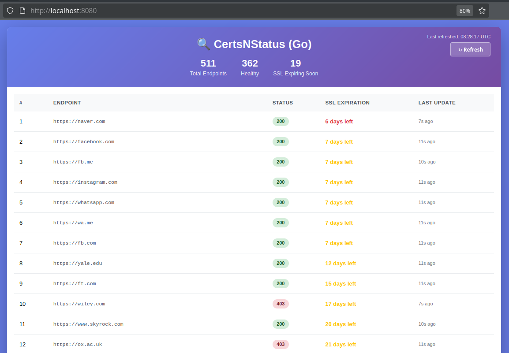

# CertsNStatus (WIP)

**CertsNStatus** is a lightweight monitoring service that checks both **SSL certificate expiration** and **HTTP status** for a list of endpoints.

It’s designed for simplicity and self-hosting, featuring:
- 🔍 Periodic HTTP status checks (e.g. every minute)
- 🔒 SSL certificate expiration checks (e.g. hourly)
- 💾 Status caching in Redis
- 🌐 Simple web dashboards (built with Python Microdot an Golang)
- 🔔 Optional alerts via Slack or other webhooks

## Project Structure (DRAFT)

- **checker/** – services performing HTTP and SSL checks  
- **web/** – Microdot-based web dashboard
- **notifier/** – optional Slack/webhook integration  
- **redis/** – data store for latest results  

## Purpose

This project is created for **self-education** and to explore **GitLab CI/CD**, containerization, and lightweight service design.

## Screenshots

---

💡 _Future plans:_  
Add Docker Compose setup, K8s manifests, and CI/CD pipeline for automated testing and deployment.
